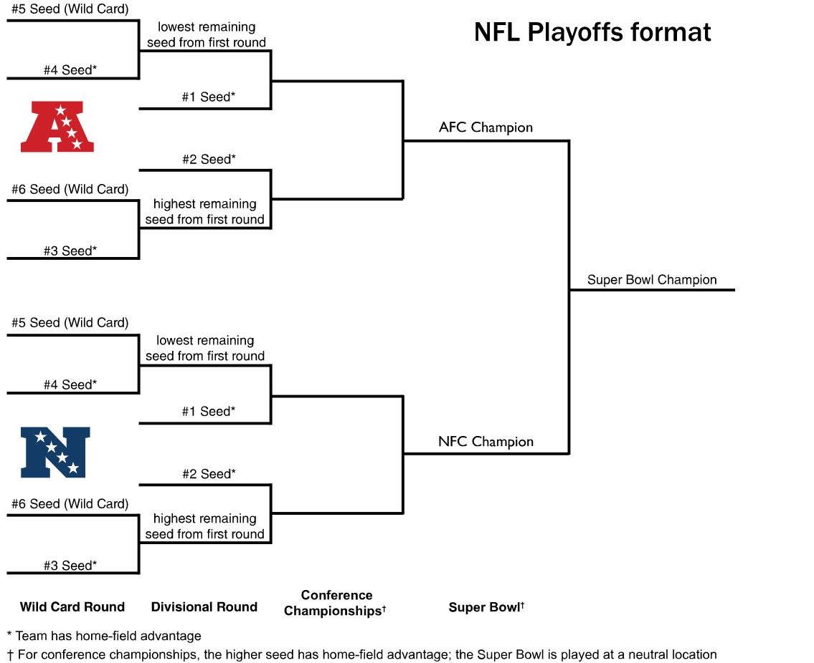

```{r setup, include = FALSE}
knitr::opts_chunk$set(echo = FALSE)

# load in the data
footballgames <- readr::read_csv('https://raw.githubusercontent.com/rfordatascience/tidytuesday/master/data/2020/2020-02-04/games.csv')
```

## Introduction

Sports Analytics: The analysis of data related to or pertaining to sports

What is Sports Analytics used for?

- Developing in-game strategies
- Evaluating player and team performance
- tracking player movement
- predicting outcomes of games
- setting betting odds
- making business decisions
- evaluating player safety

## About the NFL

{width=75%}

## About the NFL

| AFC                  | NFC                   |
|----------------------|-----------------------|
| **East**             | **East**              |
| New England Patriots | Dallas Cowboys        |
| New York Jets        | Philadelphia Eagles   |
| Miami Dolphins       | Washington Commanders |
| Buffalo Bills        | New York Giants       |
| **North**            | **North**             |
| Cincinnati Bengals   | Green Bay Packers     |
| Pittsburgh Steelers  | Chicago Bears         |
| Baltimore Ravens     | Minnesota Vikings     |
| Cleveland Browns     | Detroit Lions         |
| **West**             | **West**              |
| Denver Broncos       | Seattle Seahawks      |
| Kansas City Chiefs   | San Francisco 49ers   |
| Los Angeles Chargers | Los Angeles Rams      |
| Las Vegas Raiders    | Arizona Cardinals     |
| **South**            | **South**             |
| Indianapolis Colts   | New Orleans Saints    |
| Tennessee Titans     | Atlanta Falcons       |
| Houston Texans       | Carolina Panthers     |
| Jacksonville Jaguars | Tampa Bay Buccaneers  |

## About the NFL
{width=80%}

## Data

- The data was originally gathered by pro-football-reference
- The data was used as part of a Tidy Tuesday project, which is where we found the data
- The data has information about NFL games played from 2000-2019
- originally 19 variables in the data set
- 11 characters, 7 numeric, 1 time

Links to the data are provided below:

[data](https://github.com/rfordatascience/tidytuesday/blob/master/data/2020/2020-02-04/readme.md#gamescsv)

[data](https://www.pro-football-reference.com/boxscores/game-scores.htm)


## Data Cleaning

```{r, echo = TRUE, warning = FALSE, results = 'hide'}
##### derive categorical variable #####
# replace NA's in tie column with string 0
footballgames$tie[is.na(footballgames$tie)] <- "0"
# replace ties with string 1 instead of string with team name
for(i in 1:5324){
  if(footballgames$tie[i] != "0"){
    footballgames$tie[i] <- "1"
    i < i+1
  }
  else{
    i <- i+1
  }
}

# treat tie as categorical
footballgames$tie <- as.factor(footballgames$tie)


# get structure to check if tie is not a factor
str(footballgames)

# replace ties with string 1 instead of string with team name
for(i in 1:5324){
  if(footballgames$tie[i] == 1){
    footballgames$winner[i] <- "Tie"
    i < i+1
  }
  else{
    i <- i+1
  }
}

footballgames
```

## Data Table

| Variable Name  | Variable Description                                | Variable Type |
|-------------------|----------------------------------|-------------------|
| year           | The year in which the game was played               | numeric       |
| week           | The week of the season in which the game was played | character     |
| home_team      | name of the team playing at their home stadium      | character     |
| away_team      | name of the team playing at visiting stadium        | character     |
| winner         | name of the winning team                            | character     |
| tie            | indicates whether the game ended in a tie or not    | categorical   |
| day            | day of the week the game was played on              | character     |
| date           | date the game was played on                         | character     |
| time           | time of the day when the game started               | time          |
| pts_win        | points scored by the winning team                   | numeric       |
| pts_loss       | points scored by the losing team                    | numeric       |
| yds_win        | yards gained by the winning team                    | numeric       |
| turnovers_win  | turnovers committed by the winning team             | numeric       |
| yds_loss       | yards gained by the losing team                     | numeric       |
| turnovers_loss | turnovers committed by the losing team              | numeric       |
| home_team_name | name of the team playing at their home stadium      | character     |
| home_team_city | name of the home team's city                        | character     |
| away_team_name | name of the team playing at visiting stadium        | character     |
| away_team_city | name of the away team's city                        | character     |

## Exploratory Data Analysis

```{r, echo = FALSE, warning = FALSE, message = FALSE}

# load in libraries
library(skimr)
library(ggplot2)
library(tidyverse)
library(cowplot)

# get summary of the data
summary(footballgames)

# skim the data
skim(footballgames)

plot1 <- ggplot(footballgames, aes(y = pts_win)) + 
  geom_boxplot() + 
  ggtitle("Points Scored by the Winner") +
  ylab("Number of Points Scored")

plot2 <- ggplot(footballgames, aes(y = pts_loss)) + 
  geom_boxplot() + 
  ggtitle("Points Scored by the Loser") +
  ylab("Number of Points Scored")

plot3 <- ggplot(footballgames, aes(y = yds_win)) + 
  geom_boxplot() + 
  ggtitle("Yards Gained by the Winner") +
  ylab("Number of Yards")

plot4 <- ggplot(footballgames, aes(y = yds_loss)) + 
  geom_boxplot() + 
  ggtitle("Yards Gained by the Loser") +
  ylab("Number of Yards")

plot5 <- ggplot(footballgames, aes(y = turnovers_win)) + 
  geom_boxplot() + 
  ggtitle("Turnovers Committed by the Winner") +
  ylab("Number of Turnovers")

plot6 <- ggplot(footballgames, aes(y = turnovers_loss)) + 
  geom_boxplot() + 
  ggtitle("Turnovers Committed by the Loser") +
  ylab("Number of Turnovers")

plot_grid(plot1,plot2,plot3,plot4,plot5,plot6)

par(mfrow = c(3,2))
# histogram of points won
hist(footballgames$pts_win)

# histogram of points loss
hist(footballgames$pts_loss)

# histogram of yds win
hist(footballgames$yds_win)

# histogram of yds loss
hist(footballgames$yds_loss)

# histogram of turnovers won
hist(footballgames$turnovers_win)

# histogram of turnovers loss
hist(footballgames$turnovers_loss)


plot7 <- ggplot(footballgames, aes(x = pts_win)) +
  geom_density() +
  ggtitle("Density of Winner's Points")

plot8 <- ggplot(footballgames, aes(x = pts_loss)) +
  geom_density() +
  ggtitle("Density of Loser's Points")

plot9 <- ggplot(footballgames, aes(x = yds_win)) +
  geom_density() +
  ggtitle("Density of Winner's Yards")

plot10 <- ggplot(footballgames, aes(x = yds_loss)) +
  geom_density() +
  ggtitle("Density of Loser's Yards")

plot11 <- ggplot(footballgames, aes(x = turnovers_win)) +
  geom_density() +
  ggtitle("Density of Winner's Turnovers")

plot12 <- ggplot(footballgames, aes(x = turnovers_loss)) +
  geom_density() +
  ggtitle("Density of Loser's Turnovers")

plot_grid(plot7,plot8,plot9,plot10,plot11,plot12)

```

## AFC or NFC, who is Winning the most?

```{r, echo = FALSE, warning=FALSE, message = FALSE}
####Calculating the percentages of AFC and NFC wins whenever they face each other.
library(tidyverse)
library(magrittr)
library(dplyr)
library(ggplot2)
library(plotly)
library(dplyr)

#AFC vs NFC teams list
afc_teams<- c("Cleveland Browns","Baltimore Ravens","Pittsburgh Steelers","Cincinnati Bengals","Miami Dolphins","Buffalo Bills","New York Jets","New England Patriots", "Kansas City Chiefs","Los Angeles Chargers","Denver Broncos","Las Vegas Raiders","Tennessee Titans","Houston Texans","Indianapolis Colts","Jacksonville Jaguars", "Oakland Raiders", "San Diego Chargers")

nfc_teams<-c("Minnesota Vikings","Chicago Bears","Detroit Lions","Green Bay Packers","New York Giants","Dallas Cowboys","Washington Redskins","Philadelphia Eagles","Arizona Cardinals","Los Angeles Rams","Seattlle Seahawks","San Francisco 49ers","Atlanta Falcons","Tampa Bay Buccaneers","Carolina Panthers ","New Orleans Saints", "St. Louis Rams")

```

```{r,echo = FALSE, warning=FALSE, message = FALSE}
#Create a new column 'HT' to find which was the home team: AFC or NFC

for (i in 1:5324){
  if(footballgames$home_team[i] %in% afc_teams){
    footballgames$HT[i]<- "AFC"
  }
  else{
    footballgames$HT[i]<-"NFC"
  }
}


#Create a new column 'AT' to find which was the away team: AFC or NFC
for (i in 1:5324){
  if(footballgames$away_team[i] %in% afc_teams){
    footballgames$AT[i]<- "AFC"
  }
  else{
    footballgames$AT[i]<-"NFC"
  }
}

#Find the games AFC team vs NFC team, home and away. 

afcvsnfc<- filter(footballgames, week!= "SuperBowl", HT=="AFC" & AT=="NFC"| HT=="NFC" & AT=="AFC")
dim(afcvsnfc)
#Find out who won against AFC vs NFC only, home and away. 
for(i in 1:1288){
  if(afcvsnfc$winner[i]=="Tie"){
    afcvsnfc$win_conf[i]="Tied"
    }
    else if(afcvsnfc$winner[i] %in% afc_teams){
    afcvsnfc$win_conf[i]<- "AFC"
    }
    else{
    afcvsnfc$win_conf[i]<- "NFC"
    }  
}

#Calculate the percentage of games won by NFC and AFC teams.
table(afcvsnfc$win_conf)
#Whenever, AFC played NFC either home or away:
#AFC won 661 of the games vs. NFC 623. Remaining 4 matches ended in a tie.
```

```{r, echo = FALSE, warning=FALSE, message = FALSE, results = 'hide', fig.keep = 'all'}
#Barplot of number of games won, AFC vs NFC playing each other only. 
plot_afcvsnfc_total_win<-afcvsnfc %>%
  ggplot(aes(x = win_conf, fill = win_conf)) + 
  geom_bar() + 
  geom_text(stat='count', aes(label=..count..), vjust=0) + 
  ggtitle("Number of games won by respective divison playing home and away ") +
  xlab("Winning Division Team") +ylab("Number of games won")+guides(fill=guide_legend(title="Win Conf."))
    scale_fill_discrete(labels=c('AFC Win', 'NFC Win','Tied')) 

plot_afcvsnfc_total_win 
```

## AFC or NFC, who is Winning the most?

```{r,echo = FALSE, warning=FALSE, message = FALSE}
pts_afcvsnfc<- ggplot(filter(afcvsnfc, winner!= "Tie"))+geom_boxplot(aes(x=win_conf,y=pts_win, fill= win_conf))+xlab("Winning Conference")+ylab("Points Won")+scale_y_continuous(limits = c(0, 60))+ggtitle("Points won by AFC Vs NFC Conference teams at home and away.")+ guides(fill=guide_legend(title="Win Conf."))

ggplotly(pts_afcvsnfc)

#Mean points won by winning conference's team when AFC played NFC. 
mean(afcvsnfc$pts_win)
#28.4
mean(afcvsnfc$pts_win[afcvsnfc$win_conf=="AFC"])
#28.6
mean(afcvsnfc$pts_win[afcvsnfc$win_conf=="NFC"])
#28.1
```

## What does the Number of Wins at Home look like for AFC vs NFC teams?

```{r,echo = FALSE, warning = FALSE, message = FALSE, results = 'hide', fig.keep = 'all'}
library(grid)
library(gridExtra)
#Number of games won at home by NFC teams whenever they played AFC teams.

###First create a data with home team being NFC team and away team being AFC team. 
homewin_nfc<-filter(footballgames, week!= "SuperBowl", footballgames$home_team %in% nfc_teams & footballgames$away_team %in% afc_teams )

dim(homewin_nfc)

###To find out which division won when NFC played at home. 
for(i in 1:557){
  if(homewin_nfc$winner[i]=="Tie"){
     footballgames$win_conf[i]<-"Tied"
  }
  else if(homewin_nfc$winner[i]%in% afc_teams){
    homewin_nfc$win_conf[i]<-"AFC_Win"
  }
  else{
    homewin_nfc$win_conf[i]<-"NFC_Win"  
  }
}

#Calculate the number of games won by NFC team at home.
table(homewin_nfc$win_conf)

#Number of games won at home by AFC teams whenever they played NFC teams.

homewin_afc<-filter(footballgames, week!= "SuperBowl", footballgames$home_team %in% afc_teams & footballgames$away_team %in% nfc_teams )

dim(homewin_afc)

###To find out which division won when AFC played at home. 
for(i in 1:556){
  if(homewin_afc$winner[i]=="Tie"){
     homewin_afc$win_conf[i]<-"Tied"
  }
  else if(homewin_afc$winner[i]%in% afc_teams){
    homewin_afc$win_conf[i]<-"AFC_Win"
  }
  else{
    homewin_afc$win_conf[i]<-"NFC_Win"  
  }
}
#Calculate the number of games won by AFC team at home.
table(homewin_afc$win_conf)


#Bar plot for the number of games won by NFC team at home. 
plot_nfc_home<-homewin_nfc %>%
  ggplot(aes(x = win_conf, fill = win_conf)) + 
  geom_bar() + 
  geom_text(stat='count', aes(label=..count..), vjust=0) + 
  ggtitle("Number of games won by each conference's team when NFC played at home") +   xlab("Winning Conference") +ylab("Number of games won")+guides(fill=guide_legend(title="Win Conf."))+
    scale_fill_discrete(labels=c('AFC Win', 'NFC Win'))

#Bar plot for the number of games won by AFC team at home. 
plot_afc_home<-homewin_afc %>%
  ggplot(aes(x = win_conf, fill = win_conf)) + 
  geom_bar() + 
  geom_text(stat='count', aes(label=..count..), vjust=0) + 
  ggtitle("Number of games won by each conference's team when AFC played at home") +
  xlab("Winning Conference") +ylab("Number of games won")+guides(fill=guide_legend(title="Win Conf."))
    scale_fill_discrete(labels=c('AFC Win', 'NFC Win', 'Tied')) 

grid.arrange(plot_nfc_home,plot_afc_home, ncol=2)

```

## Comparison of Points for AFC and NFC Teams Playing each other.

```{r,echo = FALSE, warning = FALSE}
plot_pts_nfc_home<-ggplot(data=homewin_nfc, aes(x=win_conf,y=pts_win, fill= win_conf))+geom_boxplot() +stat_summary(fun.y=mean, geom="point", shape=20, size=3, color="purple", fill="purple")+xlab("Winning Conference")+ylab("Points Won")+scale_y_continuous(limits = c(0, 60))+ggtitle("Distribution of points won by AFC Vs NFC teams at NFC's home.")+ guides(fill=guide_legend(title="Win Conf."))

ggplotly(plot_pts_nfc_home)

plot_pts_afc_home<-filter(homewin_afc, winner != "Tie") %>% ggplot(aes(x=win_conf, y=pts_win, fill= win_conf))+ geom_boxplot()+stat_summary(fun.y=mean, geom="point", shape=20, size=3, color="purple", fill="purple")+xlab("Winning Conference")+ylab("Points Won")+scale_y_continuous(limits = c(0, 60))+ggtitle("Points won by AFC Vs NFC teams at AFC's home.")+ guides(fill=guide_legend(title="Win Conf."))

ggplotly(plot_pts_afc_home)

grid.arrange(plot_pts_nfc_home, plot_pts_afc_home ,ncol=2)

```

## Which Conference Won the most Super Bowls from 2000-2019?

```{r, echo = FALSE, warning = FALSE, message = FALSE, results = 'hide', fig.keep = 'all'}
#Who are winning the most number of SuperBowl from 2000 to 2019?

Superbowl_week<- filter(footballgames, week =="SuperBowl")
dim(Superbowl_week)

###To find out which division won in Superbowl. 
for(i in 1:20){
  if(Superbowl_week$winner[i] %in% afc_teams){
    Superbowl_week$win_conf[i]="AFC Team"
  }
  else{
    Superbowl_week$win_conf[i]="NFC Team"
  }
}  
#Calculate the number of Superbowls Won by AFC and NFC team.
table(Superbowl_week$win_conf)

#Barplot of Superbowl winners.
plot_Superbowl_win_conf<-Superbowl_week %>%
  ggplot(aes(x = win_conf, fill = win_conf)) + 
  geom_bar() + 
  geom_text(stat='count', aes(label=..count..), vjust=0) + 
  ggtitle("Number of games won by each conference in Superbowl") +
  xlab("Winning Conference") +ylab("Number of games won")+guides(fill=guide_legend(title="Win Conf"))
    scale_fill_discrete(labels=c('AFC Win', 'NFC Win')) 

plot_Superbowl_win_conf 
```

## Is there an Advantage in Playing at Home?

```{r, echo = FALSE, warning=FALSE, message = FALSE}
### Comparing the number of games won by the home team to the number of games won by the away team ###
library(tidyverse)
# create a vector of 0's
locationofwin <- rep(c(0), 5324)

# add vector of 0's to the data 
footballgames <- cbind(footballgames, locationofwin)

# for loop to assign values of 1 if the home team won the game
# values of 0 if the home team did not win the game
for(i in 1:5324){
  if(footballgames$week[i] == "SuperBowl"){
    footballgames$locationofwin[i] <- NA
  }
  else if(footballgames$winner[i] == footballgames$home_team[i]){
    footballgames$locationofwin[i] <- 1
    i < i+1
  }
  else{
    i <- i+1
  }
}

# count the number of wins by the home team and the number of losses/ties by the home team
#table(footballgames$locationofwin)
# 3025
# 2279

# convert locationofwin to categorical
footballgames$locationofwin <- as.factor(footballgames$locationofwin)

# bar plot of games won by home team and games won by away team
footballgames %>%
  filter(!is.na(locationofwin)) %>%
  ggplot(aes(x = locationofwin, fill = locationofwin)) + 
  geom_bar() + 
  geom_text(stat='count', aes(label=..count..), vjust=0) + 
  ggtitle("Comparing Games Won by the Away Team to Games Won by the Home Team") +
    scale_fill_discrete(labels=c('Away Team Won', 'Home Team Won')) 

```

## Is there an Advantage in Playing at Home?

```{r, echo = FALSE, warning = FALSE, results = 'hide'}
# create for loop to create vector for home points and away points
# also create vectors for home and away turnovers and home and away yards
footballgames$homepts <- rep(c(0), 5324)
footballgames$awaypts <- rep(c(0), 5324)
footballgames$hometurnovers <- rep(c(0), 5324)
footballgames$awayturnovers <- rep(c(0), 5324)
footballgames$homeyds <- rep(c(0), 5324)
footballgames$awayyds <- rep(c(0), 5324)

for(i in 1:5324){
  if(footballgames$week[i] == "SuperBowl"){
    footballgames$homepts[i] <- NA
    footballgames$awaypts[i] <- NA
    footballgames$hometurnovers[i] <- NA
    footballgames$awayturnovers[i] <- NA
    footballgames$homeyds[i] <- NA
    footballgames$awayyds[i] <- NA
    i <- i + 1
  }
  else if(footballgames$home_team[i] == footballgames$winner[i]){
    footballgames$homepts[i] <- footballgames$pts_win[i]
    footballgames$awaypts[i] <- footballgames$pts_loss[i]
    footballgames$hometurnovers[i] <- footballgames$turnovers_win[i]
    footballgames$awayturnovers[i] <- footballgames$turnovers_loss[i]
    footballgames$homeyds[i] <- footballgames$yds_win[i]
    footballgames$awayyds[i] <- footballgames$yds_loss[i]
    i <- i + 1
  }
  else if(footballgames$away_team[i] == footballgames$winner[i]){
    footballgames$homepts[i] <- footballgames$pts_loss[i]
    footballgames$awaypts[i] <- footballgames$pts_win[i]
    footballgames$hometurnovers[i] <- footballgames$turnovers_loss[i]
    footballgames$awayturnovers[i] <- footballgames$turnovers_win[i]
    footballgames$homeyds[i] <- footballgames$yds_loss[i]
    footballgames$awayyds[i] <- footballgames$yds_win[i]
    i <- i + 1
  }
  else{
    footballgames$homepts[i] <- footballgames$pts_win[i]
    footballgames$awaypts[i] <- footballgames$pts_loss[i]
    footballgames$hometurnovers[i] <- NA
    footballgames$awayturnovers[i] <- NA
    footballgames$homeyds[i] <- NA
    footballgames$awayyds[i] <- NA
  }
}

filteredfootballgames <- footballgames %>% drop_na()

# create vectors to allow for plotting
homeawayvec <- c(rep(c("home"),5294),rep(c("away"),5294))
pts <- c(filteredfootballgames$homepts, filteredfootballgames$awaypts)
yds <- c(filteredfootballgames$homeyds, filteredfootballgames$awayyds)
turnovers <- c(filteredfootballgames$hometurnovers, filteredfootballgames$awayturnovers)

# create data frames for plotting
pts <- data.frame(pts, homeawayvec)
yds <- data.frame(yds, homeawayvec)
turnovers <- data.frame(turnovers, homeawayvec)

# treat vector of home and away as categorical
pts$homeawayvec <- as.factor(pts$homeawayvec)
yds$homeawayvec <- as.factor(yds$homeawayvec)
turnovers$homeawayvec <- as.factor(turnovers$homeawayvec)


```

```{r, echo = FALSE, warning = FALSE}
# boxplot of yards gained by home and away teams
yds %>%
  ggplot(aes(y = yds, fill = homeawayvec)) + 
  geom_boxplot() + 
  ggtitle("Comparing Yards Gained by Away Teams to Yards Gained by the Home Team") +
    scale_fill_discrete(labels=c('Away Team', 'Home Team')) +
      xlab("Home or Away Team")
```

```{r, echo = FALSE, warning = FALSE}
# conduct a t test to compare means
t.test(yds$yds ~ yds$homeawayvec)
```

## Is there an Advantage in Playing at Home?

```{r, echo = FALSE, warning = FALSE}
# boxplot of points scored by home and away teams
pts %>%
  ggplot(aes(y = pts, fill = homeawayvec)) + 
  geom_boxplot() + 
  ggtitle("Comparing Points Scored by the Away Team to Points Scored by the Home Team") +
    scale_fill_discrete(labels=c('Away Team', 'Home Team')) +
      xlab("Home or Away Team")
```

```{r, echo = FALSE, warning = FALSE}
# conduct a t test to compare means
t.test(pts$pts ~ pts$homeawayvec)
```

## Is there an Advantage in Playing at Home?

```{r, echo = FALSE, warning = FALSE}
# boxplot of turnovers committed by home and away teams
turnovers %>%
  ggplot(aes(y = turnovers, fill = homeawayvec)) + 
  geom_boxplot() + 
  ggtitle("Comparing Turnovers Committed by the Away Team to Turnovers Committed by the Home Team") +
    scale_fill_discrete(labels=c('Away Team', 'Home Team')) +
      xlab("Home or Away Team")
```

```{r, echo = FALSE, warning = FALSE}
# conduct a t test to compare means
t.test(turnovers$turnovers ~ turnovers$homeawayvec)
```

## Which AFC West teams will do well in the next season? (Broncos)

```{r, echo = FALSE, warning = FALSE, message = FALSE}
library(dplyr)
library(ggplot2)
library(stringr)
library(ggthemes)                             

#filtering out broncos games
broncosgames<-filter(footballgames, home_team == "Denver Broncos" | away_team == "Denver Broncos")

#number of games played each year
broncosplays<-broncosgames %>%
  group_by(`year`) %>%
  summarise(number_of_games = n())

#filtering out the games that the Broncos won
broncoswins<-filter(broncosgames, winner == "Denver Broncos")

#number of games won by the Broncos
broncosnumberofwins<-broncoswins %>%
  group_by(`year`) %>%
  summarise(number_of_wins = n())

#joining the tables before plotting and adding the winning ratio
broncosnumbers<-inner_join(broncosplays, broncosnumberofwins)
broncosnumbers<- 
  broncosnumbers %>% 
  mutate(winning_percentage = broncosnumbers$number_of_wins/broncosnumbers$number_of_games)

#plotting the ratio as line and plotting the tables
ggplot(data = broncosnumbers, aes(x = year, y = winning_percentage)) +
  labs(title = "Broncos' Percentage of Wins through 2000 - 2019",
         x = "Year",
         y = "Percentage of Wins") +
  geom_line(colour = 'orange') +
  geom_point(colour = 'orange') + 
  theme_stata()
```

```{r, echo = FALSE, warning = FALSE, message = FALSE}
library(tsibble)
library(tidyverse)
library(fable)
library(lubridate)
library(ggplot2)
library(feasts)
library(ggfortify)

# Create a time series object 
broncosts <- broncosnumbers %>% 
  as_tsibble(index = year)

# Select the best ARIMA model automatically
fitwinpercentages <- broncosts %>%
  model(ARIMA(winning_percentage ~ PDQ(0,0,0)))
report(fitwinpercentages)


# Forecast and plot
fitwinpercentages %>% forecast(h = 3) %>% autoplot(broncosts, color = 'orange')
fitwinpercentagesfc <- fitwinpercentages %>% forecast(h = 3)

```

```{r, echo = FALSE, warning = FALSE, message = FALSE}
fitwinpercentagestrend <- broncosts %>%
model(TSLM(winning_percentage ~ trend()))
report(fitwinpercentagestrend)

# forecast and plot
fitwinpercentagestrend %>% forecast(h = 3) %>% autoplot(broncosts, color = 'orange')
fitwinpercentagestrendfc <- fitwinpercentagestrend %>% forecast(h = 3)
```

```{r, echo = FALSE, warning = FALSE, message = FALSE}
# Time plot of winning percentage and predicted winning percentage with a trend model
augment(fitwinpercentagestrend) %>%
  ggplot(aes(x = year)) +
  geom_line(aes(y = winning_percentage, colour = "Data")) +
  geom_line(aes(y = .fitted, colour = "Fitted")) +
  labs(x = "Year", y = "Winning Percentage",
       title = "Winning Percentage vs Trended Winning Percentage")
```

## Which AFC West teams will do well in the next season? (Chiefs)

```{r, echo = FALSE, warning = FALSE, message = FALSE}
#filtering out chiefs games
chiefsgames<-filter(footballgames, home_team == "Kansas City Chiefs" | away_team == "Kansas City Chiefs")

#number of games played each year
chiefsplays<-chiefsgames %>%
  group_by(`year`) %>%
  summarise(number_of_games = n())

#filtering out the games that the Chiefs won
chiefswins<-filter(chiefsgames, winner == "Kansas City Chiefs")

#number of games won by the Chiefs
chiefsnumberofwins<-chiefswins %>%
  group_by(`year`) %>%
  summarise(number_of_wins = n())

#joining the tables before plotting and adding the winning ratio
chiefsnumbers<-inner_join(chiefsplays, chiefsnumberofwins)
chiefsnumbers<- 
  chiefsnumbers %>% 
  mutate(winning_percentage = chiefsnumbers$number_of_wins/chiefsnumbers$number_of_games)

#plotting the ratio as line and plotting the tables
ggplot(data = chiefsnumbers, aes(x = year, y = winning_percentage)) +
  labs(title = "Chiefs' Percentage of Wins through 2000 - 2019",
         x = "Year",
         y = "Percentage of Wins") +
  geom_line(colour = 'red') +
  geom_point(colour = 'red') +
  theme_stata()

```

```{r, echo = FALSE, warning = FALSE, message = FALSE}
# packages already loaded in

# Create a time series object 
chiefsts <- chiefsnumbers %>% 
  as_tsibble(index = year)

# Select the best ARIMA model automatically
fitwinpercentages <- chiefsts %>%
  model(ARIMA(winning_percentage ~ PDQ(0,0,0)))
report(fitwinpercentages)

# Forecast and plot
fitwinpercentages %>% forecast(h = 3) %>% autoplot(chiefsts, color = 'red')
fitwinpercentagesfc <- fitwinpercentages %>% forecast(h = 3)

```

```{r, echo = FALSE, warning = FALSE, message = FALSE}
# fit trended model
fitwinpercentagestrend <- chiefsts %>%
model(TSLM(winning_percentage ~ trend()))
report(fitwinpercentagestrend)

# forecast and plot
fitwinpercentagestrend %>% forecast(h = 3) %>% autoplot(chiefsts, color = 'red')
fitwinpercentagestrendfc <- fitwinpercentagestrend %>% forecast(h = 3)
```

```{r, echo = FALSE, warning = FALSE, messsage = FALSE}
# Time plot of winning percentage and predicted winning percentage with a trend model
augment(fitwinpercentagestrend) %>%
  ggplot(aes(x = year)) +
  geom_line(aes(y = winning_percentage, colour = "Data")) +
  geom_line(aes(y = .fitted, colour = "Fitted")) +
  labs(x = "Year", y = "Winning Percentage",
       title = "Winning Percentage vs Trended Winning Percentage")
```

## Which AFC West teams will do well in the next season? (Chargers)

```{r, echo = FALSE, warning = FALSE, message = FALSE}
#filtering out chargers games
chargersgames<-filter(footballgames, home_team == "San Diego Chargers" | away_team == "San Diego Chargers" | home_team == "Los Angeles Chargers" | away_team == "Los Angeles Chargers")

#number of games played each year
chargersplays<-chargersgames %>%
  group_by(`year`) %>%
  summarise(number_of_games = n())

#filtering out the games that the Chargers won
chargerswins<-filter(chargersgames, winner == "Los Angeles Chargers" | winner == "San Diego Chargers")

#number of games won by the Chargers
chargersnumberofwins<-chargerswins %>%
  group_by(`year`) %>%
  summarise(number_of_wins = n())

#joining the tables before plotting and adding the winning ratio
chargersnumbers<-inner_join(chargersplays, chargersnumberofwins)
chargersnumbers<- 
  chargersnumbers %>% 
  mutate(winning_percentage = chargersnumbers$number_of_wins/chargersnumbers$number_of_games)

#plotting the ratio as line and plotting the tables
ggplot(data = chargersnumbers, aes(x = year, y = winning_percentage)) +
  labs(title = "Chargers' Percentage of Wins through 2000 - 2019",
         x = "Year",
         y = "Percentage of Wins") +
  geom_line(colour = 'blue') +
  geom_point(colour = 'blue') +
  theme_stata()
```

```{r, echo = FALSE, warning = FALSE, message = FALSE}
# packages already loaded in

# Create a time series object 
chargersts <- chargersnumbers %>% 
  as_tsibble(index = year)

# Select the best ARIMA model automatically
fitwinpercentages <- chargersts %>%
  model(ARIMA(winning_percentage ~ PDQ(0,0,0)))
report(fitwinpercentages)

# Forecast and plot
fitwinpercentages %>% forecast(h = 3) %>% autoplot(chargersts, color = 'blue')
fitwinpercentagesfc <- fitwinpercentages %>% forecast(h = 3)


```

```{r, echo = FALSE, warning = FALSE, message = FALSE}
# fit trended model
fitwinpercentagestrend <- chargersts %>%
model(TSLM(winning_percentage ~ trend()))
report(fitwinpercentagestrend)

# forecast and plot
fitwinpercentagestrend %>% forecast(h = 3) %>% autoplot(chargersts, color = 'blue')
fitwinpercentagestrendfc <- fitwinpercentagestrend %>% forecast(h = 3)
```

```{r, echo = FALSE, warning = FALSE, messsage = FALSE}
# Time plot of winning percentage and predicted winning percentage with a trend model
augment(fitwinpercentagestrend) %>%
  ggplot(aes(x = year)) +
  geom_line(aes(y = winning_percentage, colour = "Data")) +
  geom_line(aes(y = .fitted, colour = "Fitted")) +
  labs(x = "Year", y = "Winning Percentage",
       title = "Winning Percentage vs Trended Winning Percentage")
```

## Which AFC West teams will do well in the next season? (Raiders)

```{r, echo = FALSE, warning = FALSE, message = FALSE}
#filtering out raiders games
raidersgames<-filter(footballgames, home_team == "Oakland Raiders" | away_team == "Oakland Raiders")

#number of games played each year
raidersplays<-raidersgames %>%
  group_by(`year`) %>%
  summarise(number_of_games = n())

#filtering out the games that the Raiders won
raiderswins<-filter(raidersgames, winner == "Oakland Raiders")

#number of games won by the Raiders
raidersnumberofwins<-raiderswins %>%
  group_by(`year`) %>%
  summarise(number_of_wins = n())

#joining the tables before plotting and adding the winning ratio
raidersnumbers<-inner_join(raidersplays, raidersnumberofwins)
raidersnumbers<- 
  raidersnumbers %>% 
  mutate(winning_percentage = raidersnumbers$number_of_wins/raidersnumbers$number_of_games)

#plotting the ratio as line and plotting the tables
ggplot(data = raidersnumbers, aes(x = year, y = winning_percentage)) +
  labs(title = "Raiders' Percentage of Wins through 2000 - 2019",
         x = "Year",
         y = "Percentage of Wins") +
  geom_line(colour = 'black') +
  geom_point(colour = 'black') +
  theme_stata()
```

```{r, echo = FALSE, warning = FALSE, message = FALSE}
# packages already loaded in

# Create a time series object 
raidersts <- raidersnumbers %>% 
  as_tsibble(index = year)

# Select the best ARIMA model automatically
fitwinpercentages <- raidersts %>%
  model(ARIMA(winning_percentage ~ PDQ(0,0,0)))
report(fitwinpercentages)

# Forecast and plot
fitwinpercentages %>% forecast(h = 3) %>% autoplot(raidersts, color = 'black')
fitwinpercentagesfc <- fitwinpercentages %>% forecast(h = 3)

```

```{r, echo = FALSE, warning = FALSE, message = FALSE}
fitwinpercentagestrend <- raidersts %>%
model(TSLM(winning_percentage ~ trend()))
report(fitwinpercentagestrend)

# forecast and plot
fitwinpercentagestrend %>% forecast(h = 3) %>% autoplot(raidersts, color = 'black')
fitwinpercentagestrendfc <- fitwinpercentagestrend %>% forecast(h = 3)
```

```{r, echo = FALSE, warning = FALSE, message = FALSE}
# Time plot of winning percentage and predicted winning percentage with a trend model
augment(fitwinpercentagestrend) %>%
  ggplot(aes(x = year)) +
  geom_line(aes(y = winning_percentage, colour = "Data")) +
  geom_line(aes(y = .fitted, colour = "Fitted")) +
  labs(x = "Year", y = "Winning Percentage",
       title = "Winning Percentage vs Trended Winning Percentage")

```

## Which AFC West teams will do well in the next season? (Combined Historical Plots, no projection)

```{r, echo = FALSE, warning = FALSE, message = FALSE}
#joining the tables together for all the teams and creating interactive plot for the teams
raidersnumbers<-raidersnumbers %>% 
  mutate(team_name = "Oakland Raiders")
chiefsnumbers<-chiefsnumbers %>% 
  mutate(team_name = "Kansas City Chiefs")
chargersnumbers<-chargersnumbers  %>% 
  mutate(team_name = "Los Angeles Chargers")
broncosnumbers<-broncosnumbers  %>% 
  mutate(team_name = "Denver Broncos")
combinedtables<-bind_rows(raidersnumbers, chiefsnumbers, chargersnumbers, broncosnumbers)

library(plotly)
finalplot<-ggplot(data = combinedtables, aes(x = year, color = team_name, y = winning_percentage)) +
  labs(title = "AFC West Percentage of Wins through 2000 - 2019",
         x = "Year",
         y = "Percentage of Wins",
       color = "Team Name") +
  geom_line() +
  geom_point() +
  scale_colour_manual(values = c("Oakland Raiders" = "black", "Kansas City Chiefs" = "red", "Los Angeles Chargers" = "blue", "Denver Broncos" = "orange")) +
  theme_stata()
ggplotly(finalplot)
```

## Which Team won the most Super Bowls from 2000-2019?
```{r, echo = FALSE, warning=FALSE, message = FALSE}
library(tidyverse)
library(ggplot2)
library(ggthemes)
library(stringr)
#filtering the superbowl matches
superbowlgames<-filter(footballgames, week == "SuperBowl") %>%
  group_by(`winner`) %>%
  summarise(number_of_wins = n()) %>%
  slice_max(order_by = number_of_wins, n=3)

#Creating a barplot of the frequency of superbowl wins of the 4 teams that won the most superbowls
ggplot(data = superbowlgames, aes(x = reorder(winner, -number_of_wins), y = number_of_wins, fill=winner)) +
  labs(title = "Frequency of SuperBowl Wins",
         x = "Team",
         y = "Percentage of Wins") +
  geom_bar(stat = "identity") +
  theme_stata()
```

## Conclusion

## Future Research

## References
[data](https://github.com/rfordatascience/tidytuesday/blob/master/data/2020/2020-02-04/readme.md#gamescsv)

[data](https://www.pro-football-reference.com/boxscores/game-scores.htm)

[NFL Playoff Format](https://commons.wikimedia.org/wiki/File:NFL_Playoffs_format_bracket.svg)

[List of Super Bowl Champions](https://en.wikipedia.org/wiki/List_of_Super_Bowl_champions)

[NFL Standings](https://www.espn.com/nfl/standings)

